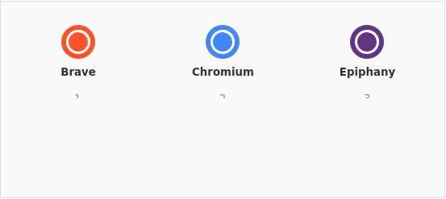

<div align="center">

# Braus

**Pick the right browser, every single time you click a link.**

[](https://github.com/thecodejedi/braus/actions/workflows/ci.yml)
[](LICENSE)
[](https://snapcraft.io/braus)

A small GTK4/libadwaita application for GNU/Linux that lets you choose which
browser opens a link — every time.



*GNU/Linux alternative to Choosy (macOS), BrowserChooser (Windows) and
Browserosaurus (macOS).*

</div>

---

## What it does

Normally your desktop has **one** default browser, and every link — from your
chat app, mail client, terminal, or anywhere else — opens in that one browser.

Braus changes that. You set **Braus** as your default browser, and it shows
you a quick picker with every installed browser whenever a link is clicked:

- **Choose on every click** — click a browser button (or press its number
  key, `1`–`9` then `0` for the 10th) and the link opens there.
- **Automatic rules** — map URLs to browsers once
  (`braus --set`) and those links skip the picker entirely. Work links in
  your work browser, videos in your media browser.
- **One keystroke** — Braus is built for muscle memory: open, tap a number,
  done. `Escape` dismisses without launching anything; `Enter` opens the
  first browser.

It's especially useful for web developers and anyone using multiple browsers
or profiles (personal, work, containers…).

## Install

### Snap (recommended)

[](https://snapcraft.io/braus)

```bash
sudo snap install braus
```

### Flatpak

Grab the [Flatpak manifest](com.properlypurple.braus.json) and build it:

```bash
flatpak remote-add --if-not-exists flathub https://flathub.org/repo/flathub.flatpakrepo
flatpak-builder --user --install --force-clean \
    --install-deps-from=flathub build-dir com.properlypurple.braus.json
```

### Download a release

Every [release](https://github.com/thecodejedi/braus/releases) ships two
artifacts, built and tested by CI:

- **`braus-<version>.tar.xz`** — standard Meson source tarball (with
  sha256sum). Build as shown below.
- **`com.properlypurple.braus-<version>.flatpak`** — single-file Flatpak
  bundle; install it directly, no store needed:

  ```bash
  flatpak install --user com.properlypurple.braus-<version>.flatpak
  ```

Releases are triggered by pushing a `X.Y.Z` tag (which must match the
version in `meson.build`); see [release workflow](.github/workflows/release.yml).

### From source

Requires Python 3, GTK 4, libadwaita 1.4+, Meson 0.62+ and gettext
(on Debian/Ubuntu: `sudo apt install meson gettext gir1.2-gtk-4.0 gir1.2-adw-1 python3-gi`).

```bash
git clone https://github.com/thecodejedi/braus
cd braus
meson setup build --prefix=/usr
sudo meson install -C build
```

Or download a release tarball from the
[releases page](https://github.com/thecodejedi/braus/releases) — it is a
standard Meson dist tarball:

```bash
tar xf braus-<version>.tar.xz
cd braus-<version>
meson setup build --prefix=/usr
sudo meson install -C build
```

### Arch Linux (AUR)

```bash
yay -S braus
```

## Getting started

When Braus runs for the first time it offers to become your default browser.
**Accept** — Braus only intercepts links if it *is* the default browser.

You can also set it manually later, e.g. in GNOME Settings → Default
Applications, or re-trigger the prompt with *Never ask to be default*
unchecked.

### The picker

- The URL to open is shown at the top — click it to edit.
- Every installed browser appears as a card with its icon.
- Press the number shown under a card (`1`–`9`, then `0`) to open instantly.
- `Enter` opens the first browser; `Escape` closes Braus without opening
  anything.

### Automatic URL rules

Send specific URLs straight to a browser, skipping the picker:

```bash
braus --set http://my-fancy-url.com firefox.desktop
braus --set https://work.example.com chromium_chromium.desktop
braus --set http://my-videos.org google-chrome.desktop
```

The first argument is a prefix — every URL starting with it is matched. The
second is the `.desktop` file name of the browser (find yours with
`ls /usr/share/applications | grep -i browser`).

Setting the same prefix again overwrites the previous mapping instead of
adding a duplicate.

Clear all mappings with:

```bash
braus --clear
```

List the current mappings with:

```bash
braus --get-mappings
```

### Command-line reference

| Command | Effect |
|---|---|
| `braus [URL]` | Show the picker for `URL` (or a blank picker) |
| `braus --set <prefix> <browser.desktop>` | Always open URLs starting with `<prefix>` in that browser |
| `braus --clear` | Remove all URL rules |
| `braus --get-mappings` | Print all URL rules |
| `braus --version` | Print the version |

## Building and contributing

```bash
git clone https://github.com/thecodejedi/braus
cd braus
meson setup build
meson compile -C build
meson test -C build
```

Linting uses [ruff](https://docs.astral.sh/ruff/) (`ruff check src/`, config
in [`ruff.toml`](ruff.toml)). CI runs lint, build and metadata validation on
every push and pull request, and publishes a versioned release tarball as a
workflow artifact — see the
[Actions tab](https://github.com/thecodejedi/braus/actions).

Run the freshly built app without installing:

```bash
GSETTINGS_SCHEMA_DIR=build/share/glib-2.0/schemas ./build/bin/braus
```

## Project layout

| Path | What it is |
|---|---|
| `src/main.py` | `Adw.Application`, command-line handling, About window |
| `src/window.py` | The picker window, hotkeys, toasts, banner |
| `src/browser_mappings.py` | URL-rule storage (GSettings) and matching |
| `data/` | Desktop file, metainfo, GSettings schema, app icon |
| `po/` | Translations (gettext) |
| `com.properlypurple.braus.json` | Flatpak manifest |
| `snap/snapcraft.yaml` | Snap packaging |

---

© 2020 Kavya Gokul

This program is free software: you can redistribute it and/or modify it under
the terms of the GNU General Public License as published by the Free Software
Foundation, either version 3 of the License, or (at your option) any later
version. See [LICENSE](LICENSE) for details.
